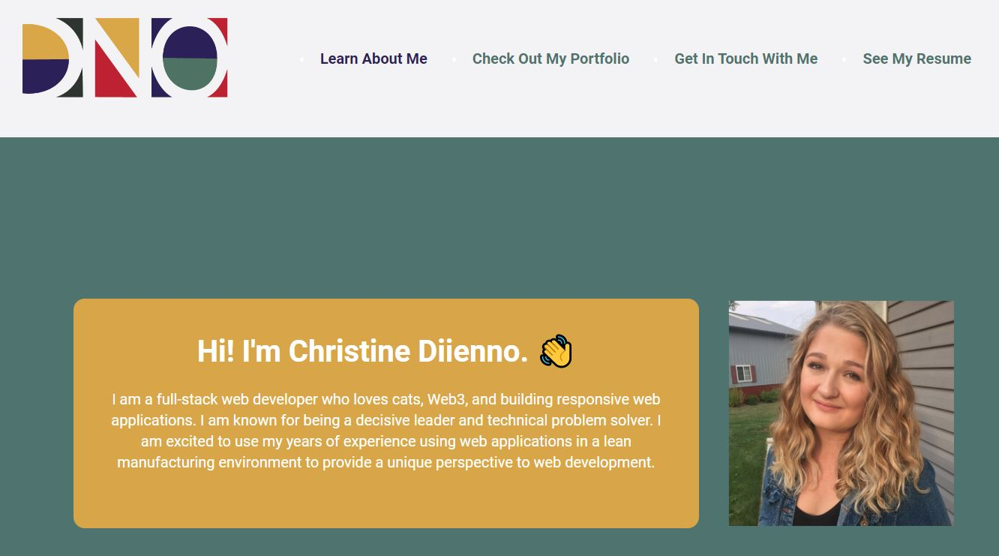

# Christine's React Portfolio

## Table of Contents

- [Christine's React Portfolio](#christines-react-portfolio)
  - [Table of Contents](#table-of-contents)
  - [Description](#description)
  - [Usage](#usage)
  - [Contributing](#contributing)
  - [License](#license)
  - [Questions](#questions)

## Description

*Built using:*

</object>

This is my portfolio that I build using the React front end framework. I had some fun with CSS animations with this as well. I hope you like it!

## Usage

You can find the deployed page here: [GitHub](https://mrsdno.github.io/christine-react-portfolio/#resume)

## Contributing

If you would like to contribute to this project, create a pull request or reach out to me directly at the email below.

## License

Copyright © 2022 Christine Diienno

This project is licensed under the [MIT License](https://mit-license.org/).

## Questions

Do you have any questions? 

You can find my github profile with contact details here: [mrsdno](https://github.com/mrsdno)

Or you can email me here: [christine@dno.dev](mailto:christine@dno.dev)

